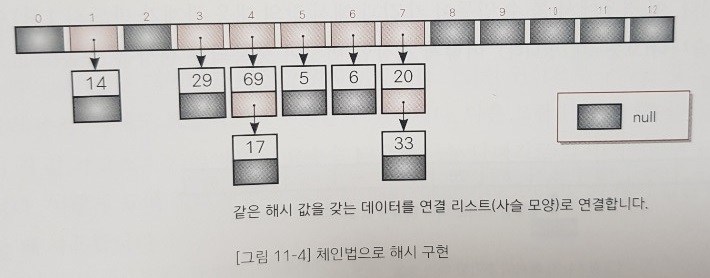
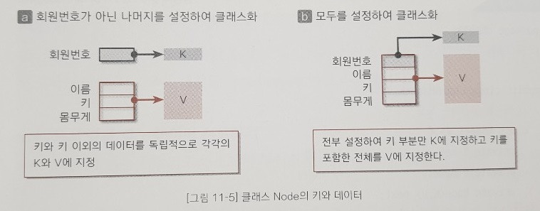

출처 : 자료구조와 함께 배우는 알고리즘 입문 자바편 (이지스퍼블리싱, 강민 옮김)

<br>

## 해시법

### 1. 개요

 **해시법**은 데이터를 저장할 위치(index)를 간단한 연산으로 구하는 것으로, 검색뿐만 아니라 추가, 삭제도 효율적으로 수행할 수 있다. 

 **해시값**은 *배열의 각 요소값을 배열의 요솟수로 나눈 나머지*로 구할 수 있으며, 데이터에 접근할 때 사용된다.

 해시값이 인덱스가 되도록 원래의 키 값을 저장한 배열이 **해시 테이블**이라고 한다. 

 키 값을 가지고 해시 값을 만들어내는 함수를 **해시함수**라고 하며, 보통 '배열의 각 요소값을 배열의 요솟수로 나눈 나머지  또는 이런 나머지 연산을 다시 응용한 연산'을 사용한다. 그리고 해시 테이블의 각 요소를 **버킷**이라고 한다.

|            키 값            |  5   |  6   |  14  |  20  |  29  |  34  |  37  |  51  |  69  |  75  |
| :-------------------------: | :--: | :--: | :--: | :--: | :--: | :--: | :--: | :--: | :--: | :--: |
| 해시 값(13으로 나눈 나머지) |  5   |  6   |  1   |  7   |  3   |  8   |  11  |  12  |  4   |  10  |

새로운 값 35를 추가하더라도, 해시 값은 9 이므로 빈 공간이기 때문에 다른 요소가 이동할 필요 없이 그대로 삽입하면 된다.

<br>

### 2. 충돌

이어서 배열에 새로운 값 18을 추가하는 경우를 생각해보면, 18의 해시 값은 5인데, 이 버킷에는 이미 값 5가 존재한다. 이 경우에서 볼 수 있듯이 키 값과 해시 값의 대응 관계가 반드시 1대1 이라는 보증은 없다(보통 n대 1이다). 이렇게 저장할 버킷이 중복되는 현상을 **충돌** 이라고 한다.

그래서 해시 함수는 가능하면 해시 값이 치우치지 않도록 고르게 분포된 값을 만들어야 한다.

<br>

#### 충돌에 대한 대처

충돌이 발생할 경우에는 아래의 두 가지 방법으로 대처할 수 있다.

1. [체인법](#3-체인법) : 같은 해시 값을 갖는 요소를 연결 리스트로 관리한다.
2. [오픈 주소법](#4-오픈주소법): 빈 버킷을 찾을 때까지 해시를 반복한다.

<br>

### 3. 체인법

체인법은 같은 해시 값을 갖는 데이터를 쇠사슬 모양으로 연결 리스트에서 연결하는 방법으로, **오픈 해시법**이라고도 한다.

<br>

### 같은 해시 값을 갖는 데이터 저장하기

다음 그림 11-4 는 체인법으로 구현한 해시의 한 예이다. (해시함수는 % 13)



<br>

체인법은 같은 해시 값을 갖는 데이터를 연결 리스트에 의해 사슬 모양으로 연결한다. **배열의 각 버킷(해시 테이블)에 저장하는 값은 그 인덱스를 해시 값으로 하는 연결리스트의 첫 번째 노드에 대한 참조**이다.

예를 들어, 그림 11-4 에서 69와 17의 해시 값은 모두 4 이며, 이들을 연결하는 연결리스트의 첫 번째 노드에 대한 참조를 table[4]에 저장한다. 또 해시 값(인덱스) 0과 2처엄 데이터가 하나도 없는 버킷의 값은 null을 가리킨다.

<br>

### 버킷용 클래스 Node<K, V>

개별 버킷을 나타낸 것이 클래스 Node<K, V> 이다. 이 클래스에는 아래 세 가지 필드가 있다.

> - key : 키 값(K는 임의의 자료형)
> - data : 데이터(V는 임의의 자료형)
> - next : 체인의 다음 노드에 대한 참조

<br>

```java
// 해시를 구성하는 노드
class Node<K, V> {
    private K key;              // 키 값
    private V data;             // 데이터
    private Node<K, V> next;    // 다음 노드에 대한 참조

    // 생성자
    Node(K key, V data, Node<K,V> next) {
        this.key = key;
        this.data = data;
        this.next = next;
    }

    // 키 값 반환
    K getKey() {
        return key;
    }

    // 데이터 반환
    V getValue() {
        return data;
    }

    // 키의 해시 값 반환
    public int hashCode() {
        return key.hashCode(); 
    }
}
```

<br>

제너릭 클래스인 Node<K, V>가 전달받는 매개변수의 자료형은 키 값의 자료형 K와 데이터의 자료형 V이다. K와 V는 독립적인 참조이므로, 예를 들어 데이터가 '회원번호, 이름, 키, 몸무게'로 구성되어 있고, '회원번호'를 키로 하여 나타내면 그림 11-5의 a, b의 두 메서드 모두 사용할 수 있다.



<br>

### 해시 클래스 ChainHash<K, V> 필드

해시 클래스 ChainHash<K,V>에는 두 필드가 있다.

> - size : 해시 테이블의 크기(table(배열)의 요솟수)
>
> - table : 해시 테이블을 저장하는 배열

<br>

```java
public class ChainHash<K, V> {
    private int size;               // 해시 테이블의 크기
    private Node<K, V>[] table;     // 해시 테이블

    // 생성자
    public ChainHash(int capacity) {
        try {
            table = new Node[capacity];
            this.size = capacity;
        } catch (OutOfMemoryError e) { // 테이블을 생성할 수 없음
            this.size = 0;
        }
    }

    // 해시 값을 구함
    public int hashValue(Object key) {
        return key.hashCode() % size;
    }
}
```

<br>

#### 생성자 ChainHash

클래스 ChainHash<K, V>의 생성자는 비어 있는 해시 테이블을 생성하며, 매개변수 capacity에 전달받는 것은 해시 테이블의 용량이다. 요솟수가 capacity인 배열 table의 본체를 생성하고 capacity 값을 필드 size에 복사한다.

해시 테이블의 각 버킷은 맨 앞부터 table[0] table[1], ..., table[size - 1]로 접근할 수 있다. 생성자가 호출된 직 후 배열 table의 모든 요소는 null을 참조하며, 모든 버킷이 비어있는 상태가 된다.

또한 메모리 확보에 실패할 경우 size에 0을 넣는다.

<br>

#### hashValue 메서드

해시 값을 구하는 메서드이다. key의 해시 값을 해시 테이블의 크기 size로 나눈 나머지를 반환한다.

<br>

> **해시와 해시 함수에 대하여**
>
> 만약 충돌이 전혀 발생하지 않는다면 해시 함수로 인덱스를 찾는 것만으로 검색, 추가, 삭제가 거의 완료되므로 그 시간 복잡도는 어느 것이나 O(1)이 된다.
>
> 해시 테이블을 크게 하면 충돌 발생을 억제할 수는 있지만 다른 한편으로 메모리를 쓸데없이 많이 차지한다. 즉, 시간과 공간의 절충(trade-off)이라는 문제가 항상 따라다닌다.
>
> 충돌을 피하기 위해 해시 함수는 해시 테이블의 크기 이하의 정수를 되도록 한쪽으로 치우치지 않고 고르게 만들어 내야 한다. 그래서 해시 테이블의 크기는 소수가 좋다고 알려져 있다.
>
> 키 값이 정수가 아닌 경우 해시 값을 구할 때는 좀 더 신경을 써 방법을 모색해야 한다. 예컨대 실수 키 값에 대해 비트 연산을 하는 방법, 문자열 키 값에 대해 각 문자 코드에 곱셈과 덧셈을 하는 방법이 있다.

<br>

```java
// 키 값 key를 갖는 요소의 검색(데이터 반환)
public V search(K key) {
    int hash = hashValue(key);      // 검색할 데이터의 해시 값
    Node<K, V> p = table[hash];     // 선택 노드

    while (p != null) {
        if (p.getKey().equals(key)) return p.getValue();    // 검색 성공
        p = p.next;                                         // 다음 노드에 주목
    }

    return null;    // 검색 실패
}

// 키 값 key, 데이터 data를 갖는 요소의 추가
public int add(K key, V data) {
    int hash = hashValue(key);      // 추가할 데이터의 해시 값
    Node<K, V> p = table[hash];     // 선택 노드

    while (p != null) {
        if (p.getKey().equals(key)) // 이 키 값은 이미 등록 되어있으므로 실패
            return 1;
        p = p.next;                 // 다음 노드에 주목
    }

    Node<K, V> temp = new Node<K, V>(key, data, table[hash]); // 원래 있던 값을 밀어내고
    table[hash] = temp;             // 리스트의 맨 앞 위치에 노드를 삽입
    return 0;
}
```

<br>

#### 키 값으로 요소를 검색하는 search 메서드

키 값이 key인 요소를 검색하는 메서드이다. 검색 과정은 아래와 같다.

1. 해시 함수가 키 값을 해시 값으로 변환한다.
2. 해시 값을 인덱스로 하느 버킷을 선택한다.
3. 선택한 버킷의 연결 리스트를 처음부터 순서대로 검색한다. 키 값과 같은 값을 찾으면 검색 성공이다. 끝까지 스캔하여 찾지 못할 경우 검색에 실패한다.

<br>

#### 요소를 추가하는 add 메서드

키 값이 key이고 데이터가 data인 요소를 삽입하는 메서드이다. 추가 과정은 아래와 같다.

1. 해시 함수가 키 값을 해시 값으로 변환한다.
2. 해시 값을 인덱스로 하는 버킷을 선택한다.
3. 버킷이 가리키는 연결 리스트를 처음부터 순서대로 검색한다. 키 값과 같은 값을 찾으면 키 값이 이미 등록된 상태이므로 추가에 실패한다. 끝까지 스캔하여 찾지 못하면 리스트의 맨 앞 위치에 노드를 삽입한다.

<br>

```java
// 키 값 key를 갖는 요소의 삭제
public int remove(K key) {
    int hash = hashValue(key);      // 삭제할 데이터의 해시 값
    Node<K, V> p = table[hash];     // 선택 노드
    Node<K, V> pp = null;           // 바로 앞의 선택 노드

    while (p != null) {
        if (p.getKey().equals(key)) {               // 삭제할 키 값을 찾으면
            if (pp == null) table[hash] = p.next;   // 이전 노드가 null 이면 제일 앞에 삭제한 다음 노드 두기
            else pp.next = p.next;                  // 아니면 이전 노드의 다음 노드로 삭제한 다음 노드 두기
            return 0;
        }
        pp = p;
        p = p.next; // 다음 노드
    }
    return 1; // 그 키 값은 존재 하지 않음. (삭제 실패)
}

// 해시 테이블 덤프
public void dump() {
    for (int i = 0; i < size; i++) {
        Node<K, V> p = table[i];
        System.out.printf("%02d  ", i);
        while (p != null) {
            System.out.printf("  -> %s (%s)", p.getKey(), p.getValue());
            p = p.next;
        }
        System.out.println();
    }
}
```

<br>

#### 요소를 삭제하는 remove  메서드

키 값이 key인 요소를 삭제하는 메서드이다. 삭제 과정은 아래와 같다.

1. 해시 함수가 키 값을 해시 값으로 변환한다.
2. 해시 값을 인덱스로 하는 버킷을 선택한다.
3. 버킷이 가리키는 연결 리스트를 처음부터 순서대로 검색한다. 키 값과 같은 값을 찾으면 그 노드를 리스트에서 삭제한다. 그렇지 않으면 삭제에 실패한다.

<br>

#### 해시 테이블의 모든 내용을 출력하는 dump 메서드

해시 테이블의 내용을 통째로 출력한다.

<br>

#### 사용 예1

```java
public static void main(String[] args) {
    ChainHash<Integer, String> ch = new ChainHash<>(13);
    ch.add(39, "원지연");
    ch.add(23, "원지팡");
    ch.add(17, "고구려");
    ch.add(9, "이순신");
    ch.add(13, "불닭 볶음면");
    ch.add(15, "개구리");
    ch.add(26, "떡볶이");
    ch.dump();

    String result = ch.search(23);
    if (result != null) {
        System.out.printf("검색 성공 : %d - %s\n", 23, result);
    }
}
```


<br>

#### 사용 예 2

```java
class ChainHashTester_11_01 {
    static Scanner stdIn = new Scanner(System.in);

    // 데이터(회원번호+이름)
    static class Data {
        static final int NO = 1;    // 번호를 입력 받습니까?
        static final int NAME = 2;  // 이름을 입력 받습니까?

        private Integer no;     // 회원번호 (키값)
        private String name;    // 이름

        // 키값
        String keyCode() {
            return Integer.toString(no);
        }

        // 문자열을 반환합니다.
        public String toString() {
            return name;
        }

        // 데이터를 입력 받음
        void scanData(String guide, int sw) { // 번호, 이름을 입력받으면 11, 번호만 입력받으면 01 (이진수)
            System.out.println(guide + "하는 데이터를 입력하세요.");

            if ((sw & NO) == NO) {
                System.out.print("번호：");
                no = stdIn.nextInt();
            }
            if ((sw & NAME) == NAME) {
                System.out.print("이름：");
                name = stdIn.next();
            }
        }
    }

    // 메뉴열거형
    enum Menu {
        ADD("데이터 추가"), REMOVE("데이터 삭제"), SEARCH("데이터 검색"), DUMP("모든  데이터 출력"), TERMINATE("종료");

        private final String message; // 표시용 문자열

        static Menu MenuAt(int idx) { // 서수가 idx 인 열거를 반환
            for (Menu m : Menu.values())
                if (m.ordinal() == idx)
                    return m;
            return null;
        }

        Menu(String string) { // 생성자
            message = string;
        }

        String getMessage() { // 표시용 문자열을 반환
            return message;
        }
    }

    // 메뉴선택
    static Menu SelectMenu() {
        int key;
        do {
            for (Menu m : Menu.values()) {
                System.out.printf("(%d) %s  ", m.ordinal(), m.getMessage());
            }
            System.out.print("：");
            key = stdIn.nextInt();
        } while (key < Menu.ADD.ordinal() || key > Menu.TERMINATE.ordinal()); // 메뉴(0~4)를 입력할 경우 반복 종료

        return Menu.MenuAt(key);
    }

    public static void main(String[] args) {
        Menu menu;                  // 메뉴
        Data data;                  // 추가용 데이터 참조
        Data temp = new Data();     // 입력 받기용 데이터

        ChainHash<String, Data> hash = new ChainHash<String, Data>(13);

        do {
            switch (menu = SelectMenu()) { // 열거형은 ordinal 이 반환되어 switch 에서 사용 가능
                case ADD:
                    data = new Data();
                    data.scanData("추가", Data.NO | Data.NAME);
                    int k = hash.add(data.keyCode(), data);
                    switch (k) {
                        case 1:
                            System.out.println("그 키값은 이미 등록되어 있습니다.");
                            break;
                        case 2:
                            System.out.println("해시 테이블이 가득 찼습니다.");
                            break;
                    }
                    break;

                case REMOVE:
                    temp.scanData("삭제", Data.NAME);
                    hash.remove(temp.keyCode());
                    break;

                case SEARCH:
                    temp.scanData("검색", Data.NO);
                    Data t = hash.search(temp.keyCode());
                    if (t != null)
                        System.out.println("그 키를 갖는 데이터는 " + t + "입니다.");
                    else
                        System.out.println("해당 하는 데이터가 없습니다.");
                    break;

                case DUMP: // 출력
                    hash.dump();
                    break;
            }
        } while (menu != Menu.TERMINATE);
    }
}
```

<br>

### 4. 오픈주소법

(다음 시간에~)