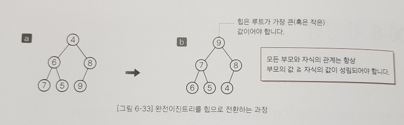

출처 : 자료구조와 함께 배우는 알고리즘 입문 자바편 (이지스퍼블리싱, 강민 옮김)

<br>

## 힙정렬

선택 정렬을 응용한 알고리즘인 힙 정렬은 힙의 특성을 이용하여 정렬을 수행한다.

<br>

### 1. 힙이란?

힙 정렬은 힙을 사용하여 정렬하는 알고리즘이다. 힙은 '부모의 값이 자식의 값보다 항상 크다'는 조건(최대힙)을 만족하는 완전이진트리이다. 이때 부모의 값이 자식보다 항상 작아도 힙이라고 한다. (최소힙. 부모와 자식 요소의 관계만 일정하면 된다.)

<br>

그림 6-33의 `a`는 힙이 아닌 완전이진트리이다. `a`를 힙으로 만들면 `b`와 같은 상태가 된다. 부모와 자식 관계는 항상 '부모의 값 >= 자식의 값'이다. 따라서 힙의 가장 위쪽에 있는 루트가 가장 큰 값이 된다.

<br>

> \# 트리에 대한 간단한 설명
>
> 트리의 가장 윗 부분을 루트라고 한다. 그리고 요소의 상하 관계를 '부모'와 '자식'이라고 한다. 그리고 자식 간의 관계는 '형제'라고 한다.
>
> 완전이진트리란 트리의 한 종류를 말한다. 사람도 유전적인 특징에 의해 분류하는 것처럼 트리의 종류도 여러 가지이다. 완전이진트리의 특징은 '완전이진' 상태라는 것이다. 여기서 '완전'이라는 말은 부모는 자식을 왼쪽부터 추가하는 모양을 유지한다는 뜻이다. 그리고 '이진'이라는 말은 '부모가 가질 수 있는 자식의 개수는 최대 2개다'라는 의미이다.

<br>



**힙에서 부모와 자식 관계는 일정**하지만 **형제 사이의 대소 관계는 일정하지 않다.** 예를 들어 그림 `b`에서 형제인 7과 8중 작은 쪽 7은 왼쪽에 있지만 6과 5 중 작은 쪽 5는 오른쪽에 있다.

> 힙은 형제의 대소 관계가 정해져 있지 않은 특성이 있어 '부분순서트리' 라고도 한다.

<br>

그림 6-34는 힙의 요소를 배열에 저장하는 과정을 나타낸 것이다. 먼저 가장 위쪽에 있는 루트(10)을 a[0]에 넣는다. 그리고 한 단계 아래 요소를 왼쪽에서 오른쪽으로 따라 간다. 이때 인덱스의 값을 1씩 늘리면서 배열의 각 요소에 힙의 요소를 대입한다.

<p align="center">
    
</p>

이 과정을 거쳐 힙의 요소를 배열에 저장하면 부모와 자식의 인덱스 사이에 다음과 같은 관계가 성립한다.

```
1. 부모는 a[(i - 1) / 2]
2. 왼쪽 자식은 a[i * 2 + 1]
3. 오른쪽 자식은 a[i * 2 + 2]
```

<br>

### 2. 힙 정렬

힙 정렬은 '가장 큰 값이 루트에 위치'하는 특징을 이용하는 정렬 알고리즘이다. 힙에서 가장 큰 값인 루트를 꺼내는 작업을 반복하고 그 값을 늘어놓으면 배열은 정렬을 마치게 된다. 즉, 힙 정렬은 선택 정렬을 응용한 알고리즘이며 힙에서 가장 큰 값인 루트를 꺼내고 남은 요소에서 다시 가장 큰 값을 구해야 한다. 다시 말해 힙으로 구성된 10개의 요소에서 가장 큰 값을 없애면 나머지 9개의 요소 중에서 가장 큰 값을 루트로 정해야 한다. 따라서 나머지 9개의 요소로 만든 트리도 힙의 형태를 유지할 수 있도록 재구성 해야한다.

<br>

#### 루트를 없애고 힙 상태 유지하기

다음은 루트를 없앤 다음 다시 힙을 만드는 순서를 그림으로 나타낸 것이다.

<p align = "center">
    </p>

힙에서 루트인 10을 꺼낸다. 그런 다음 비어있는 루트 위치로 힙의 마지막 요소(오른쪽 아래 끝에 있는 자식의 요소)인 1을 옮긴다. 이때 1 이외의 요소는 힙 상태를 유지하고 있다. 따라서 이 값만 알맞은 위치로 이동하면 힙 상태를 유지할 수 있다.

<p align = "center"> </p>

이제 루트로 이동시킨 1을 올바른 위치로 보내야 한다. 현재 이동할 1의 자식은 9와 5이다. 힙이 되려면 이 3개의 값 가운데 가장 큰 값이 위쪽에 있어야 한다. '부모의 값 >= 자식의 값'이라는 힙의 조건을 만족하려면 두 자식을 비교하여 큰 쪽인 9와 바꾸면 된다. 그러면 1이 왼쪽으로 내려온다.

<p align = "center"> </p>

1의 두 자식은 8과 3이다. 앞에서와 마찬가지로 큰 값을 가진 8과 바꾼다. 그러면 1이 왼쪽으로 내려온다.

<p align = "center"> </p>

1의 두 자식은 6과 7이다. 큰 값을 가진 오른쪽 7과 바꾸면 1이 오른쪽으로 내려온다. 이제 1을 트리의 가장 아랫부분으로 이동시켰으니 작업을 마치게 된다.

<br>

이렇게 만든 트리는 힙 상태를 유지하게 된다. 여기에서는 1을 가장 아래까지 옮겼다. 하지만 요소를 항상 끝까지 옮겨야 하는 것은 아니다. 옮길 요소보다 왼쪽이나 오른쪽의 두 자식이 더 작으면 바꿀 수 없다. 이때 루트를 없앤 다음 다시 힙을 만들기 위해 요소를 알맞은 위치로 내려보내야 하는데 그 순서는 다음과 같다.

```
1. 루트를 꺼낸다.
2. 마지막 요소를 루트로 이동한다.
3. 자기보다 큰 값을 가지는 자식 요소와 자리를 바꾸며 아래쪽으로 내려가는 작업을 반복한다. 이때 자식의 값이 작거나 단말노드(leaf)에 다다르면 작업이 종료된다.
```

<br>

#### 힙 정렬 알고리즘 살펴보기

이제 이 힙을 사용하여 힙 정렬 알고리즘으로 확장하면 된다. 그림 6-35(는 생략)를 보며 힙 정렬 알고리즘의 흐름을 살펴보자.

> 1. 힙의 루트(a[0])에 있는 가장 큰 값(10)을 꺼내 배열 마지막 요소(a[9])와 바꾼다.
> 2. 가장 큰 값을 a[9]로 옮기면 a[9]는 정렬을 마친다. 앞에서 살펴본 순서대로 a[0] ~ a[8]의 요소를 힙으로 만든다. 그 결과 두번째로 큰 요소인 9가 루트에 위치하게 된다. 힙의 루트 a[0]에 있는 가장 큰 값인 9를 꺼내 아직 정렬하지 않은 부분의 마지막 요소인 a[8]과 바꾼다.
> 3. 두 번째로 큰 값을 a[8]로 옮기면 a[8] ~ a[9]는 정렬을 마치게 된다. 그런 다음 a[0] ~ a[7]의 요소를 힙으로 만든다. 그 결과 세 번째로 큰 요소인 8이 루트에 위치하게 된다. 힙의 루트 a[0]에 있는 가장 큰 값인 8을 꺼내 아직 정렬하지 않은 부분의 마지막 요소인 a[7]과 바꾼다.

이를 반복하면 배열의 마지막부터 큰 값이 차례대로 대입된다. 위의 과정을 간단히 정리하면 다음과 같다.

```
1. 변수 i의 값을 n - 1로 초기화한다.
2. a[0]과 a[i]를 바꾼다.
3. a[0], a[1], ..., a[i - 1]을 힙으로 만든다.
4. i의 값을 1씩 줄여 0이 되면 끝이 난다. 그렇지 않으면 '2'로 돌아간다.
```

이 순서대로 힙 정렬을 수행하면 된다. 그런데 초기 상태의 배열이 힙 상태가 아닐 수도 있다. 따라서 이 과정을 적용하기 전에 배열을 힙 상태로 만들어야 한다.

<br>

### 3. 배열로 힙 만들기

그림 6-36과 같은 이진트리가 있다고 가정하자. 4를 루트로 하는 부분트리 `a`는 힙이 아니다. 그러나 왼쪽 자식을 8을 루트로 하는 부분트리`b` 와 오른쪽 자식 5를 루트로 하는 부분트리`c`는 모두 힙이다.

<p align = "center"> </p>

앞에서는 루트를 없앤 다음 마지막 요소를 루트로 옮기고 루트로 옮긴 요소를 알맞은 위치로 옮기면서 힙을 만들었다. 여기서도 이 방법으로 루트 4를 알맞은 위치로 옮기면 부분트리 `a`를 힙으로 만들 수 있다.

<br>

이 방법을 이용하면 아랫부분의 작은 부분트리부터 시작해 올라가는 방식(bottom-up)으로 전체 배열을 힙으로 만들 수 있다. 아래 그림들은 이 내용을 나타낸 것으로, 가장 아랫부분의 오른쪽 부분트리부터 시작해 왼쪽으로 진행하면서 힙으로 만든다. 가장 아랫부분의 단계가 끝나면 하나 위쪽으로 부분트리 범위를 확장하고 다시 왼쪽으로 진행하면서 부분트리를 힙으로 만든다.

<p align = "center"> </p>

이 트리는 힙이 아니다. 마지막(가장 아랫부분의 가장 오른쪽) 부분트리인 {9, 10}을 선택한다. 요소 9를 내려 힙으로 만든다.

<p align = "center"> </p>

바로 왼쪽의 부분트리인 {7, 6, 8}을 선택한다. 요소 7을 오른쪽으로 내려 힙으로 만든다.

<p align = "center"> </p>

가장 아랫부분의 단계가 끝났다. 이제 부분트리의 선택 범위를 위로 한 칸 확장하여 마지막(가장 오른쪽) 부분트리인 {5, 2, 4}를 선택한다. 이미 힙이므로 옮길 필요가 없다.

<p align = "center"> </p>

바로 왼쪽에 있는 부분트리(3이 루트인 부분트리)를 선택한다. 여기서는 요소 3을 오른쪽 맨 아래까지 내려 힙으로 만든다.

<p align = "center"> </p>

부분트리의 선택 범위를 위로 한 칸 확장해 트리 전체를 선택한다. 왼쪽에 있는 자식 10을 루트로 하는 부분트리와 오른쪽에 있는 자식 5를 루트로 하는 부분트리는 모두 힙이다. 그래서 요소 1을 알맞은 위치로 내려 힙으로 만들고 끝낸다.

<br>

#### 힙 정렬의 시간 복잡도

앞에서 설명한 대로 힙 정렬은 선택 정렬을 응용한 알고리즘이다. 단순 선택 정렬은 정렬되지 않은 영역의 모든 요소를 대상으로 가장 큰 값을 선택한다. 힙 정렬에서는 첫 요소를 꺼내는 것만으로 가장 큰 값이 구해지므로 첫 요소를 꺼낸 다음 나머지 요소를 다시 힙으로 먼들어야 그 다음에 꺼낼 첫 요소도 가장 큰 값을 유지한다. 따라서 단순 선택정렬에서 가장 큰 요소를 선택할 때의 시간 복잡도 O(n)의 값을 한번에 선택할 수 있어 O(1)로 줄일 수 있다. 그 대신 힙 정렬에서 다시 힙으로 만드는 작업의 시간 복잡도는 O(logn)이다.

> 루트를 알맞은 위치로 내리는 작업은 이진 검색과 비슷해 스캔할 때마다 스캔 범위가 거의 반으로 줄어들기 때문이다.

따라서 단순 선택 정렬은 전체 정렬에 걸리는 시간 복잡도의 값이 O(n^2) 이지만 힙 정렬은 힙으로 만드는 작업을 요소의 개수만큼 반복하므로 시간 복잡도의 값이 O(nlogn)으로 크게 줄어든다.

<br>

### 4. 구현 예제

```java
public class HeapSort {
    // 배열 요소 a[idx1]과 a[idx2]의 값을 바꾼다.
    static void swap(int[] a, int idx1, int idx2) {
        int t = a[idx1];
        a[idx1] = a[idx2];
        a[idx2] = t;
    }

    // a[left] ~ a[right]를 힙으로 만든다.
    // a[left] 이외에는 모두 힙 상태라고 가정, a[left]를 아랫부분의 알맞은 위치로 옮겨 힙 상태로 만든다.
    static void downHeap(int[] a, int left, int right) {
        int temp = a[left]; // 루트
        int child;          // 큰 값을 가진 노드
        int parent;         // 노드

        for (parent = left; parent < (right + 1) / 2; parent = child) {
            int cl = parent * 2 + 1;                            // 왼쪽 자식
            int cr = cl + 1;                                    // 오른쪽 자식
            child = (cr <= right && a[cr] > a[cl]) ? cr : cl;   // 큰 값을 가진 노드를 자식에 대입
            // 첫번째 조건은 오른쪽 자식이 아무것도 없을 경우 right 를 넘어선다

            if (temp >= a[child]) break;                        // 루트보다 더 큰 자식을 찾으면 멈춤
            a[parent] = a[child];
        }
        a[parent] = temp;
    }

    // 힙 정렬
    static void heapSort(int[] a, int n) {
        for (int i = (n - 1) / 2; i >= 0; i--) // 가장 단말의 마지막 부분 트리부터 시작 (오른쪽)
            downHeap(a, i, n - 1);  // a[i] ~ a[n - 1]를 힙으로 만들기

        for (int i = n - 1; i > 0; i--) {       // 마지막 요소를 맨 앞으로 옮긴다
            swap(a, 0, i);                // 가장 큰 요소와 아직 정렬되지 않은 부분의 마지막 요소를 교환
            downHeap(a, 0, i - 1);  // a[0] ~ a[i - 1]를 힙으로 만든다
        }
    }

    public static void main(String[] args) {
        Scanner stdIn = new Scanner(System.in);

        System.out.println("힙 정렬");
        System.out.print("요솟 수 :");
        int nx = stdIn.nextInt();
        int[] x = new int[nx];

        for (int i = 0; i < nx; i++) {
            System.out.printf("x[%d]:", i);
            x[i] = stdIn.nextInt();
        }

        heapSort(x, nx);

        System.out.println("오름차순으로 정렬했습니다.");
        for (int i = 0; i < nx; i++) {
            System.out.printf("x[%d] = %d\n", i, x[i]);
        }
    }
}
```

